# Diagrama de Flujo Completo: Mapeo Total AS/400 a Node.js

Este documento detalla la secuencia íntegra de los 32 pasos que componen el cierre batch de ahorros (CCACIERRE).

## 1. Secuencia Completa de Ejecución

```mermaid
graph TD
    Start((INICIO)) --> S00[<b>00:</b> PLT1001 <br/> verifyEnvironment]
    S00 --> S01[<b>01:</b> CCA500 <br/> loadDates]
    S01 --> S02[<b>02:</b> CLRPFM <br/> clearWorkFiles]
    S02 --> S03[<b>03:</b> CCA505 <br/> initAccumulators]
    S03 --> S35[<b>3.5:</b> CCA508 <br/> copyOfflineMovements]
    S35 --> S04[<b>04:</b> CCA510 <br/> consolidateInterfaces]
    S04 --> S05[<b>05:</b> CCA515 <br/> interfaceReport]
    S05 --> S06[<b>06:</b> CCA520 <br/> validateNovelties]
    S06 --> S07[<b>07:</b> CCA525 <br/> noveltyReport]
    S07 --> S08[<b>08:</b> CCA530 <br/> errorReport]
    S08 --> S09[<b>09:</b> CCA540 <br/> purgeClosedAccruals]
    S09 --> S10[<b>10:</b> CCA550 <br/> validateMonetary]
    S10 --> S11[<b>11:</b> CCA560 <br/> splitRejects]
    S11 --> S12[<b>12:</b> CCA580 <br/> updateBalances]
    S12 --> S13[<b>13:</b> CCA599 <br/> rejectReport]
    S13 --> S14[<b>14:</b> CCA590 <br/> backdateDetail]
    S14 --> S15[<b>15:</b> CCA601 <br/> dailyAccrual]
    S15 --> S16[<b>16:</b> CCA502 <br/> evaluateEndPeriod]
    S16 --> S17[<b>17:</b> CCA602 <br/> interestPayment]
    S17 --> S18[<b>18:</b> CCA606 <br/> youthIncentive]
    S18 --> S19[<b>19:</b> CCA201/205 <br/> negativeBalance]
    S19 --> S20[<b>20:</b> CCA630 <br/> generateAccounting]
    S20 --> S21[<b>21:</b> CCA660 <br/> inactivateAccounts]
    S21 --> S22[<b>22:</b> CCA661/662/664 <br/> inactiveAccounting]
    S22 --> S23[<b>23:</b> CCAACTREM <br/> updateRemittances]
    S23 --> S24[<b>24:</b> CCA671/672 <br/> trialBalance]
    S24 --> S25[<b>25:</b> CCA710/711 <br/> archiveHistory]
    S25 --> S26[<b>26:</b> CCA760/765 <br/> platformMaster]
    S26 --> S27[<b>27:</b> CCA770 <br/> accrualRotation]
    S27 --> S28[<b>28:</b> CCATRANSF <br/> treasuryTransfer]
    S28 --> S29[<b>29:</b> CCACOPIAS <br/> backups]
    S29 --> S30[<b>30:</b> CCA800 <br/> dateProjection]
    S30 --> End((FIN))

    style S00 fill:#f96,stroke:#333,stroke-width:2px
    style S12 fill:#f96,stroke:#333,stroke-width:2px
    style S30 fill:#f96,stroke:#333,stroke-width:2px
```

## 2. Tabla de Referencia Maestra (Cross-Reference)

| Paso | Programa AS/400 | Servicio Node.js | Función del Proceso |
| :--- | :--- | :--- | :--- |
| **00** | `PLT1001` | `verifyEnvironment` | Bloqueo transaccional y validación. |
| **01** | `CCA500` | `loadDates` | Carga de calendario bancario. |
| **02** | `CLRPFM` | `clearWorkFiles` | Inicialización de archivos de trabajo. |
| **03** | `CCA505` | `initAccumulators` | Reset de acumuladores diarios. |
| **3.5**| `CCA508` | `copyOfflineMovements`| Carga de movimientos fuera de línea. |
| **04** | `CCA510` | `consolidateInterfaces`| Consolidación de interfaces. |
| **05** | `CCA515` | `interfaceReport` | Reporte de cuadre de interfaces. |
| **06** | `CCA520` | `validateNovelties` | Validación de novedades de cuenta. |
| **07** | `CCA525` | `noveltyReport` | Reporte de novedades procesadas. |
| **08** | `CCA530` | `errorReport` | Listado de errores de captura. |
| **09** | `CCA540` | `purgeClosedAccruals` | Depuración de causaciones cerradas. |
| **10** | `CCA550` | `validateMonetary` | Validación integridad monetaria. |
| **11** | `CCA560` | `splitRejects` | Separación de rechazados. |
| **12** | `CCA580` | `updateBalances` | **Actualización Maestra de Saldos.** |
| **13** | `CCA599` | `rejectReport` | Reporte de movimientos rechazados. |
| **14** | `CCA590` | `backdateDetail` | Detalle de transacciones retrofechas. |
| **15** | `CCA601` | `dailyAccrual` | **Causación Diaria (Interés/Tarifas).** |
| **16** | `CCA502` | `evaluateEndPeriod` | Evaluación Fin de Mes/Trimestre. |
| **17** | `CCA602` | `interestPayment` | **Abono Masivo de Intereses.** |
| **18** | `CCA606` | `youthIncentive` | Liquidación Incentivo Juvenil. |
| **19** | `CCA201/205`| `negativeBalance` | Gestión y cobro de saldos rojos. |
| **20** | `CCA630` | `generateAccounting` | Generación de Interfaz Contable. |
| **21** | `CCA660` | `inactivateAccounts` | Proceso de Inactivación Automática. |
| **22** | `CCA661/662`| `inactiveAccounting` | Contabilidad de Inactivas/Canceladas. |
| **23** | `CCAACTREM` | `updateRemittances` | Actualización de Remesas. |
| **24** | `CCA671/672`| `trialBalance` | Generación de Balance de Prueba. |
| **25** | `CCA710/711`| `archiveHistory` | Archivo al Histórico de Movimientos. |
| **26** | `CCA760/765`| `platformMaster` | Sincronización Maestro Plataforma. |
| **27** | `CCA770` | `accrualRotation` | Rotación de Promedios Mensuales. |
| **28** | `CCATRANSF` | `treasuryTransfer` | Transmisión a Tesorería. |
| **29** | `CCACOPIAS` | `backups` | Generación de Respaldos Diarios. |
| **30** | `CCA800` | `dateProjection` | **Salto de Fecha Contable.** |

---
*Este manual garantiza que el equipo de soporte pueda localizar cualquier programa legacy en su equivalente moderno.*
